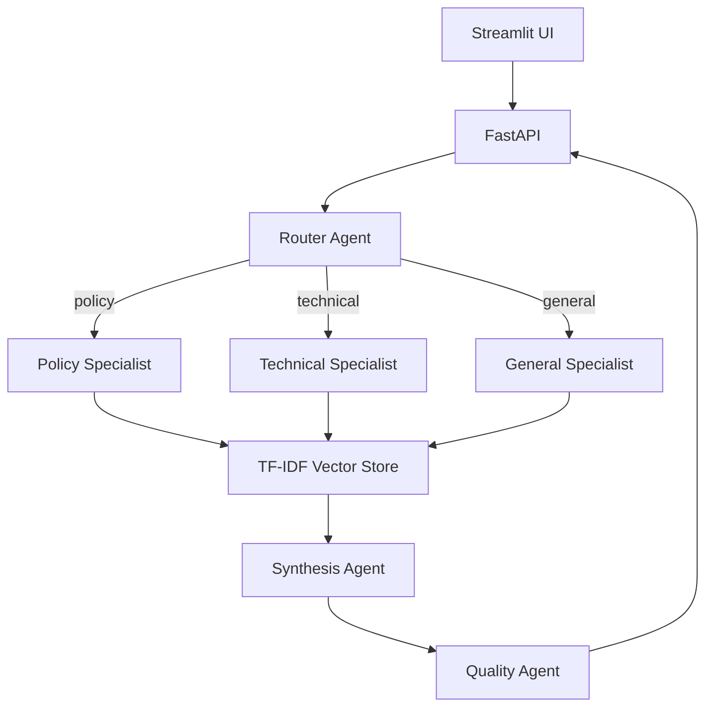

# Enterprise GenAI Agent Hub

[](https://github.com/lipsapriyadarsinee101-oss/enterprise-genai-agent-hub/actions/workflows/ci.yml)
[](https://www.python.org/)
[](https://fastapi.tiangolo.com/)
[](https://streamlit.io/)

An explainable multi-agent Retrieval-Augmented Generation (RAG) system for enterprise knowledge. It routes a business question through specialist agents, retrieves evidence, generates a cited answer, and runs a quality check before returning the result.

**Built by [Lipsa Priyadarsinee](https://github.com/lipsapriyadarsinee101-oss)** as a portfolio project for Junior GenAI Engineer roles.

## Why this project matters

Enterprise GenAI systems need more than a chatbot. They need grounded answers, traceable evidence, modular APIs, evaluation, and safe failure behaviour. This project demonstrates all five while remaining easy to run locally.

## Architecture



## Features

- Multi-agent workflow: router, retrieval specialist, synthesis, and quality agents
- RAG over Markdown and text documents with source citations
- OpenAI Responses API integration with deterministic demo fallback
- FastAPI endpoints with typed Pydantic contracts
- Streamlit chat UI with agent trace, citations, confidence, and latency
- Lightweight TF-IDF retrieval—no external vector database required
- Prompt-injection-aware context handling
- Automated evaluation for citation coverage and answer grounding
- Pytest suite, Docker Compose, health checks, and GitHub Actions CI

## Quick start

```bash
git clone https://github.com/lipsapriyadarsinee101-oss/enterprise-genai-agent-hub.git
cd enterprise-genai-agent-hub
python -m venv .venv
source .venv/bin/activate  # Windows: .venv\Scripts\activate
pip install -r requirements.txt
cp .env.example .env
uvicorn app.api:app --reload
```

In another terminal:

```bash
streamlit run streamlit_app.py
```

Open `http://localhost:8501`. Demo mode works without an API key. To enable generated answers, add `OPENAI_API_KEY` to `.env` and set `DEMO_MODE=false`.

## API

```bash
curl -X POST http://localhost:8000/v1/query \
  -H "Content-Type: application/json" \
  -d '{"question":"What controls are required before deploying an AI model?","top_k":3}'
```

Interactive API documentation is available at `http://localhost:8000/docs`.

| Endpoint | Method | Purpose |
|---|---|---|
| `/health` | GET | Service and knowledge-base status |
| `/v1/query` | POST | Run the agentic RAG workflow |
| `/v1/documents` | GET | List indexed knowledge sources |

## Evaluation

```bash
pytest -q
python -m scripts.evaluate
```

The evaluation script measures retrieval hit rate, citation coverage, groundedness, and response latency on a small labelled dataset.

## Technology stack

Python, FastAPI, Streamlit, OpenAI API, scikit-learn, Pydantic, Docker, Pytest, and GitHub Actions. The orchestration layer uses framework-independent agent interfaces so a LangChain, Azure OpenAI, AWS Bedrock, or GCP implementation can be added without changing the API contract.

## Responsible AI choices

- Retrieved documents are treated as untrusted data, not executable instructions.
- Answers explicitly state when the knowledge base lacks sufficient evidence.
- Every non-demo answer is instructed to cite retrieved sources.
- The quality agent reports citation coverage and a confidence score.
- Secrets are read from environment variables and never committed.

## Roadmap

- Hybrid dense + keyword retrieval with reranking
- PDF and DOCX ingestion
- LangSmith or OpenTelemetry traces
- Azure OpenAI deployment adapter
- Human feedback and evaluation dashboard

## License

MIT

